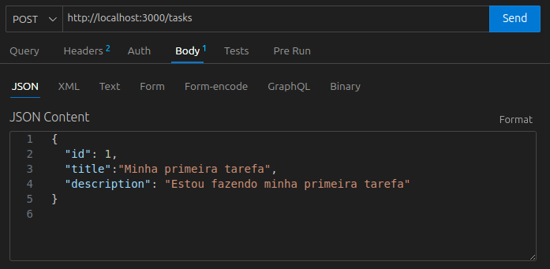
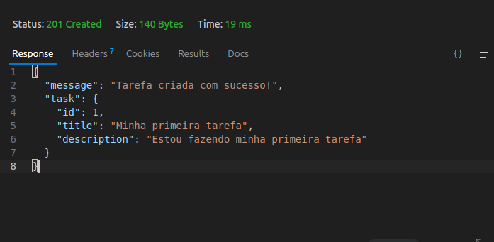
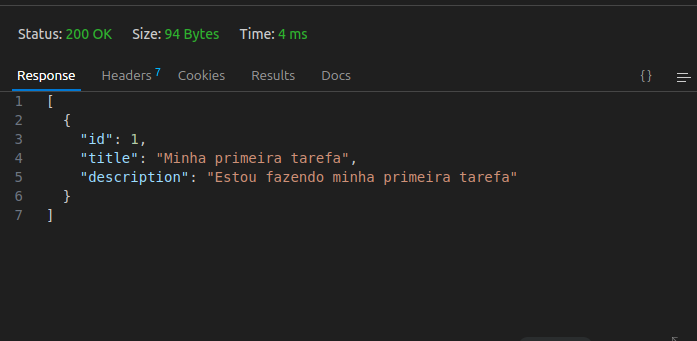
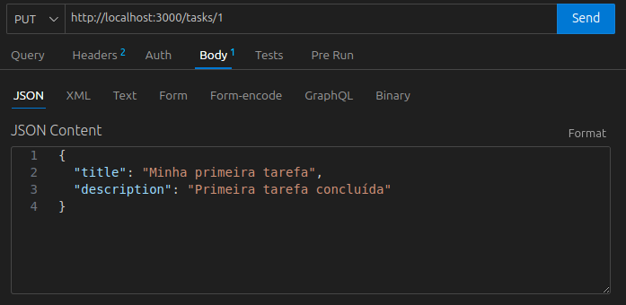
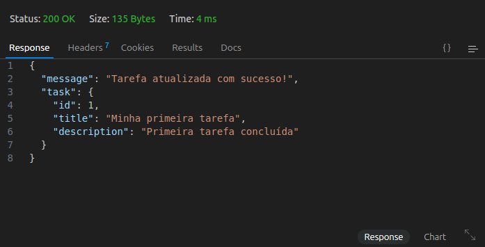
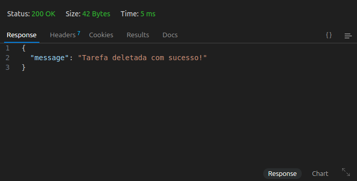

# Projeto Aprofunda: Api 

Este projeto foi desenvolvido como parte do Programa Aprofunda da PretaLab. A aplicação consiste em uma API simples para gerenciamento de tarefas, usando Node.js, Express e dados em memória.

## Tecnologias Utilizadas

- Node.js
- Express
- Nodemon
- Thunder Client (para testes)

## Funcionalidades

A API possui as seguintes rotas:

### POST
Cria uma nova tarefa.

### GET
Lista todas as tarefas cadastradas.

### PUT
Atualiza os dados de uma tarefa.

### DELETE
Remove uma tarefa.

## Autoria

Este projeto foi desenvolvido por **Geovana Mendes**, estudante de Sistemas de Informação, como parte do programa **Aprofunda** da **PretaLab**.
